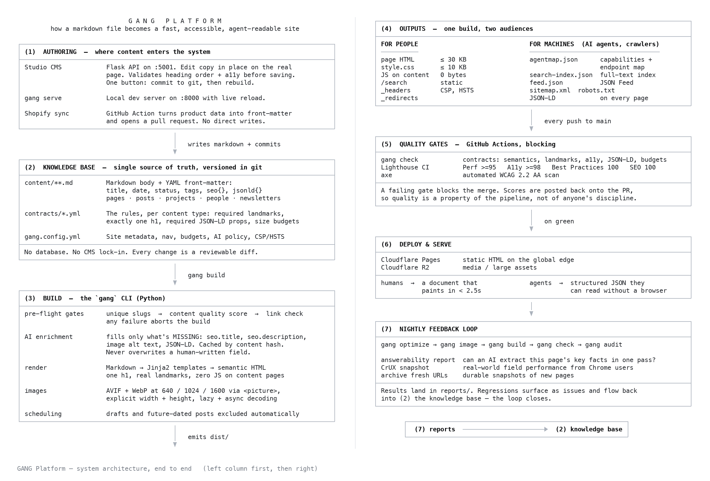

# How GANG Works, End to End

A single markdown file in `content/` is the input. A fast, accessible, machine-readable
site on the global edge is the output. Everything in between is enforced by the pipeline
rather than left to discipline.



Two renderings of the diagram are checked in. `how-it-works-wide.png` is the two-column
layout above, sized for a slide. `how-it-works.png` is a single tall column, better for a
PDF or a scrolling page. Regenerate both from the source text below with
`python3 scripts/render_diagram.py`.

<details>
<summary>Source text</summary>

```
                              G A N G   P L A T F O R M
         how a markdown file becomes a fast, accessible, agent-readable site

┌────────────────────────────────────────────────────────────────────────────────────┐
│ (1)  AUTHORING  —  where content enters the system                                 │
├────────────────────────────────────────────────────────────────────────────────────┤
│ Studio CMS            Flask API on :5001. Edit copy in place on the real           │
│                       page. Validates heading order + a11y before saving.          │
│                       One button: commit to git, then rebuild.                     │
│                                                                                    │
│ gang serve            Local dev server on :8000 with live reload.                  │
│                       Run from the gang-platform repo root (Cursor workspace).     │
│                       Build: PYTHONPATH=cli python3 -m gang.cli build (content/).  │
│                       Global `gang` may be another worktree’s editable install.    │
│                                                                                    │
│ Shopify sync          GitHub Action turns product data into front-matter           │
│                       and opens a pull request. No direct writes.                  │
└────────────────────────────────────────────────────────────────────────────────────┘
                                          │
                                          │   writes markdown + commits
                                          ▼
┌────────────────────────────────────────────────────────────────────────────────────┐
│ (2)  KNOWLEDGE BASE  —  single source of truth, versioned in git                   │
├────────────────────────────────────────────────────────────────────────────────────┤
│ content/**.md         Markdown body + YAML front-matter:                           │
│                       title, date, status, tags, seo{}, jsonld{}                   │
│                       pages · posts · projects · people · newsletters              │
│                                                                                    │
│ contracts/*.yml       The rules, per content type: required landmarks,             │
│                       exactly one h1, required JSON-LD props, size budgets         │
│                                                                                    │
│ gang.config.yml       Site metadata, nav, budgets, AI policy, CSP/HSTS             │
├────────────────────────────────────────────────────────────────────────────────────┤
│ No database. No CMS lock-in. Every change is a reviewable diff.                    │
└────────────────────────────────────────────────────────────────────────────────────┘
                                          │
                                          │   gang build
                                          ▼
┌────────────────────────────────────────────────────────────────────────────────────┐
│ (3)  BUILD  —  the `gang` CLI (Python)                                             │
├────────────────────────────────────────────────────────────────────────────────────┤
│ pre-flight gates      unique slugs  →  content quality score  →  link check        │
│                       any failure aborts the build                                 │
│                                                                                    │
│ AI enrichment         fills only what's MISSING: seo.title, seo.description,       │
│                       image alt text, JSON-LD. Cached by content hash.             │
│                       Never overwrites a human-written field.                      │
│                                                                                    │
│ render                Markdown → Jinja2 templates → semantic HTML                  │
│                       one h1, real landmarks, zero JS on content pages             │
│                                                                                    │
│ images                AVIF + WebP at 640 / 1024 / 1600 via <picture>,              │
│                       explicit width + height, lazy + async decoding               │
│                                                                                    │
│ scheduling            drafts and future-dated posts excluded automatically         │
└────────────────────────────────────────────────────────────────────────────────────┘
                                          │
                                          │   emits dist/
                                          ▼
┌────────────────────────────────────────────────────────────────────────────────────┐
│ (4)  OUTPUTS  —  one build, two audiences                                          │
├────────────────────────────────────────────────────────────────────────────────────┤
│ FOR PEOPLE                              FOR MACHINES  (AI agents, crawlers)        │
│ ──────────                              ───────────────────────────────────        │
│ page HTML       ≤ 30 KB                 agentmap.json      capabilities +          │
│ style.css       ≤ 10 KB                                    endpoint map            │
│ JS on content   0 bytes                 search-index.json  full-text index         │
│ /search         static                  feed.json          JSON Feed               │
│ _headers        CSP, HSTS               sitemap.xml  robots.txt                    │
│ _redirects                              JSON-LD            on every page           │
└────────────────────────────────────────────────────────────────────────────────────┘
                                          │
                                          │   every push to main
                                          ▼
┌────────────────────────────────────────────────────────────────────────────────────┐
│ (5)  QUALITY GATES  —  GitHub Actions, blocking                                    │
├────────────────────────────────────────────────────────────────────────────────────┤
│ gang check            contracts: semantics, landmarks, a11y, JSON-LD, budgets      │
│ Lighthouse CI         Perf >=95   A11y >=98   Best Practices 100   SEO 100         │
│ axe                   automated WCAG 2.2 AA scan                                   │
├────────────────────────────────────────────────────────────────────────────────────┤
│ A failing gate blocks the merge. Scores are posted back onto the PR,               │
│ so quality is a property of the pipeline, not of anyone's discipline.              │
└────────────────────────────────────────────────────────────────────────────────────┘
                                          │
                                          │   on green
                                          ▼
┌────────────────────────────────────────────────────────────────────────────────────┐
│ (6)  DEPLOY & SERVE                                                                │
├────────────────────────────────────────────────────────────────────────────────────┤
│ Cloudflare Pages      static HTML on the global edge                               │
│ Cloudflare R2         media / large assets                                         │
├────────────────────────────────────────────────────────────────────────────────────┤
│ humans  →  a document that              agents  →  structured JSON they            │
│            paints in < 2.5s                        can read without a browser      │
└────────────────────────────────────────────────────────────────────────────────────┘
                                          │
                                          ▼
┌────────────────────────────────────────────────────────────────────────────────────┐
│ (7)  NIGHTLY FEEDBACK LOOP                                                         │
├────────────────────────────────────────────────────────────────────────────────────┤
│ gang optimize → gang image → gang build → gang check → gang audit                  │
│                                                                                    │
│ answerability report  can an AI extract this page's key facts in one pass?         │
│ CrUX snapshot         real-world field performance from Chrome users               │
│ archive fresh URLs    durable snapshots of new pages                               │
├────────────────────────────────────────────────────────────────────────────────────┤
│ Results land in reports/. Regressions surface as issues and flow back              │
│ into (2) the knowledge base — the loop closes.                                     │
└────────────────────────────────────────────────────────────────────────────────────┘

        ┌───────────────────────────────────────────────────────────┐
        │  (7) reports  ──────────────────────▶  (2) knowledge base │
        └───────────────────────────────────────────────────────────┘
```

</details>

## The three ideas that matter

**The knowledge base is just git.** Content lives as markdown with YAML front-matter.
There is no database and no proprietary CMS. Every edit is a diff that can be reviewed,
reverted, or audited, and the whole site is portable by `git clone`.

**Quality is enforced, not aspired to.** `contracts/*.yml` declares what a valid page is
for each content type: one `h1`, required landmarks, required JSON-LD properties, and hard
size budgets. CI runs those contracts plus Lighthouse and axe on every push, and a failure
blocks the merge. A regression cannot reach production.

**One build serves people and machines.** The same pass that renders HTML also emits
`agentmap.json`, `search-index.json`, `feed.json`, `sitemap.xml`, and JSON-LD on every
page. Humans get a sub-2.5s document with zero JavaScript. AI agents get structured JSON
they can consume without rendering a browser. The nightly answerability report scores
whether an agent can extract each page's key facts in a single pass, which turns
agent-readability into a metric that can be tracked over time.
